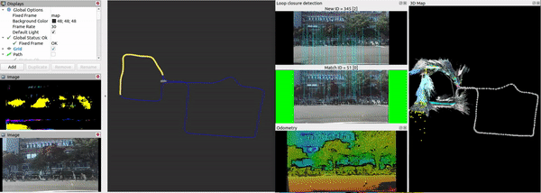

<h3 align="center">Drivable Area 3D Mapping</h3>

  🗺️RGBD 센서를 이용한 주행 가능 영역 Semantic Segmentation 및 3D Mapping 

* * *

## Video

**ORB_SLAM2+Segmentation**, **RTAB_Map+Segmentation**

  
  

**RTAB_Map+Segmentation**

  

## Description
주행 가능영역을 Semantic Segmentation하고 pointcloud로 만들어 Large Scale 3D Map에 나타내는 프로젝트입니다. 

This is a project that semantic segmentation of the drivable area and makes it into a pointcloud and displays it on a 3D map.

## Purpose
RGBD Sensor 이용한 Localization & 3D Mapping

Localization & 3D Mapping using RGBD Sensor

## Project List
* Semantic Segmentation
* Localization
* 3D Mapping
* Map Merge
